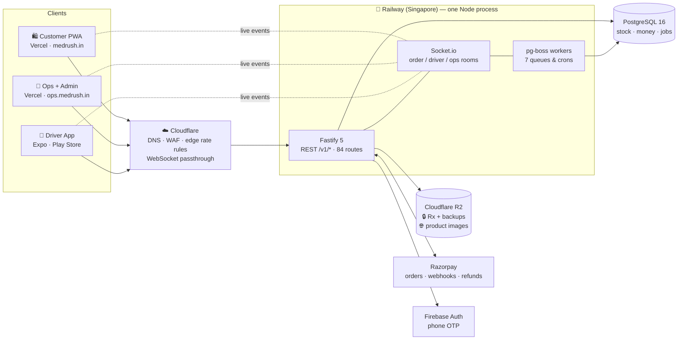
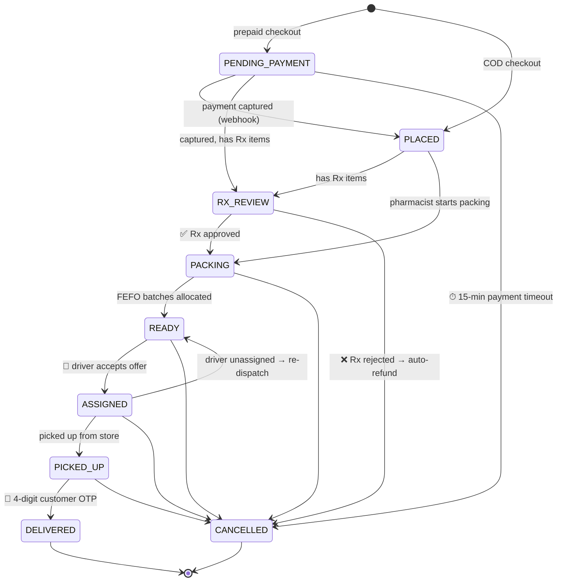

<div align="center">

# ⚡ MedRush

### Medicines & health essentials, delivered in **~40 minutes**.

*A production-grade, full-stack hyperlocal pharmacy delivery platform — one licensed dark store, a ≤5 km radius, and every line of code built like it handles money and medicine. Because it does.*

[](https://github.com/Harsh-goswami-103/Medirush/actions/workflows/ci.yml)


**4 client surfaces · 1 modular-monolith API · 84 endpoints · 9-state order machine · 197 tests**

</div>

---

## 🧭 What is this?

MedRush is the complete engineering build-out of a quick-commerce pharmacy: a customer PWA, a pharmacist ops console, an admin panel, and a driver app — all served by a single Fastify backend that owns stock, money, prescriptions, dispatch, and live tracking.

It follows a **frozen blueprint** ([`docs/BLUEPRINT.md`](docs/BLUEPRINT.md) — *amend the doc first, code second*) through 8 phases, from monorepo scaffold to launch hardening. Phases 0–7's code work is **complete**; what remains before launch is operational (real keys, Play Store listing, pharmacist-reviewed catalog — tracked in [`docs/PRODUCTION-CHECKLIST.md`](docs/PRODUCTION-CHECKLIST.md)).

> ⚕️ **The domain is unforgiving by design:** Schedule H/H1 drugs need pharmacist review before packing, invoices must be GST-compliant with FY-sequential numbering, batches expire (FEFO), COD cash must reconcile, and a delivery isn't done without the customer's OTP. Most of the interesting engineering below exists because of these constraints.

---

## 📱 Four surfaces, one backend

| Surface | Stack | What it does |
|---|---|---|
| 🛍️ **Customer PWA** — [`frontend/web`](frontend/web) | Next.js 15 · React 19 · TanStack Query · MapLibre | Browse & search catalog, server-authoritative cart, COD + Razorpay checkout, Rx upload, live order tracking on a map, notification center, GST invoice download |
| 💊 **Ops console** — [`frontend/ops`](frontend/ops) | Next.js 15 (role-gated: `INVENTORY`) | Live order board with new-order chime (Socket.io), Rx approve/reject, FEFO-guided packing, catalog CRUD, GRN batch intake, stock adjust / low-stock / near-expiry |
| 📊 **Admin panel** — same app (role: `ADMIN`) | Next.js 15 | KPI dashboard, driver verification & fleet, payout approvals, coupons, user risk-flags, Sales / GST / **Schedule-H1 register** CSV exports, store kill-switch |
| 🛵 **Driver app** — [`frontend/driver`](frontend/driver) | Expo SDK 53 · Expo Router · dark theme | Duty toggle, dispatch offers with 25-second countdown, pickup → OTP-verified delivery, COD collection, wallet ledger & payout requests, Google Maps deep-link navigation |
| 🧠 **The API** — [`backend/api`](backend/api) | Fastify 5 · Prisma 6 · Socket.io · pg-boss | All of the above: 84 routes, realtime rooms, background jobs, payments, dispatch waves — one process, one Postgres |

Clients never hand-write an API type — every schema, enum, socket event, and error code is imported from **[`packages/contracts`](packages/contracts)**, and the backend validates with the *same* Zod schemas via `fastify-type-provider-zod`. Wire types match on both sides by construction.

---

## 🏗️ Architecture



The blueprint's own request-flow one-liner:

> `PWA → Vercel CDN → Next server → GET api/v1/products → Fastify (rate-limit → Zod validate → handler) → Prisma → PG → JSON`

**Scale path** (documented now, built when needed): split pg-boss workers into a second service → add Redis + Socket.io adapter for horizontal API scaling → read replica at ~50k orders/month. None of it changes application code structure.

---

## 🔄 The order state machine

Every order mutation passes through `assertTransition(from, to, actor)` **inside its database transaction** — an illegal move is a 409, and the audit event + socket broadcast ride the same code path.



Actor rules are layered on top: **customers** one-tap cancel only early states (later ones become a review request), **drivers** never cancel outright, **ops/admin** can cancel any non-terminal state (with automatic refund of paid prepaid orders), and **the system** drives webhook/timeout/dispatch edges.

---

## 💰 Built for money, stock & medicine

The parts of this codebase that earn their keep:

- **Integer paise everywhere.** No floats touch money — prices, GST back-computation, wallet balances, payouts.
- **Idempotency as a habit.** `POST /v1/orders` and `POST /v1/driver/payouts` take an `Idempotency-Key` header — a retry replays the stored response; a concurrent double-fire is blocked by a pending-sentinel row. The Razorpay webhook is idempotent via a `PaymentEvent(eventId PK)` insert *in the same transaction* as the state change: duplicate delivery is a 200 no-op, a mid-handler crash rolls the gate back so the retry reprocesses exactly once.
- **FEFO batch picking.** Stock allocates first-expiry-first-out, deterministically, and refuses batches with <30 days shelf life — those route to the near-expiry report, never to a customer.
- **Append-only wallet ledger.** Driver earnings are `WalletTxn` rows (always-positive amounts, type carries the sign) with the invariant `balance = Σ CREDIT − Σ DEBIT`, credits serialized under `SELECT … FOR UPDATE`. A nightly **drift-audit cron** independently recomputes every balance from the ledger and alerts on any mismatch — read-only on purpose, because auto-fixing drift would hide the bug.
- **Atomic dispatch.** Offers go out in waves (3 drivers, 25-second windows); first accept wins via a conditional update — the loser gets `OFFER_TAKEN`, not a duplicate delivery.
- **Graceful zero-downtime deploys.** On SIGTERM: `/readyz` flips 503 (LB drains) → in-flight HTTP completes → sockets get `server:restarting` → pg-boss finishes in-flight jobs → Prisma disconnects → Sentry flushes. 25-second budget. A deploy never kills an order transaction.
- **Nightly encrypted backups.** `pg_dump | gzip | gpg --symmetric AES-256` → private R2, passphrase passed over fd 3 (never argv). Restore drill runbook included — *"an untested backup is a rumor."*

---

## 🛡️ Security posture

- Helmet with CSP (enforced in prod), CORS allowlist, global rate limit 100/min with `/v1/auth/sync` tightened to 20/min, 5 MB multipart cap
- Rx uploads magic-byte validated and re-encoded server-side; served only via short-lived presigned URLs from a private bucket
- **426 upgrade gate**: every `/v1/driver/*` request must present `x-app-version ≥ minDriverAppVersion` — contract breaks can't strand stale apps in undefined behavior
- Fraud defaults: 2 COD refusals → COD-blocked, max 3 orders/hour per user/address, first-order COD cap ₹500, delivery OTP locks after 5 wrong attempts
- Supply chain: every GitHub Action pinned to a full commit SHA, `pnpm` install-script allowlist (5 packages), Renovate with digest pinning, `pnpm audit` gating CI
- An adversarial security pass over the authz / money / state-machine surfaces shipped in Phase 7 (3 findings fixed with regression tests; IDOR-free — owner-scoped 404s everywhere)

---

## ⚡ Realtime & background jobs

**Socket.io** (typed end-to-end from `@medrush/contracts`): customers join `order:{id}` for status + live driver GPS (5s pings → in-memory map → throttled room broadcast), drivers join `driver:{profileId}` for offers (vibration + haptics), ops join the `ops` room for new-order chimes and alerts. Every client degrades to HTTP polling when the socket drops, and backs off when it's live.

| Job (pg-boss) | Schedule | Purpose |
|---|---|---|
| `stuck-orders-watchdog` | every 5 min | Alerts: unpacked >10 min, unassigned >7 min, undelivered >40 min |
| `payment-timeout` | +15 min per order | Auto-cancels abandoned prepaid checkouts |
| `offer-expiry` | +25 s per offer | Drives dispatch wave escalation |
| `invoice-pdf` | on delivery | GST invoice PDF (pdfkit) with FY-sequential numbering |
| `notification-fanout` | on demand | FCM push fanout |
| `db-backup` | 02:00 IST nightly | Encrypted `pg_dump` → private R2 |
| `drift-audit` | 02:30 IST nightly | Wallet-ledger reconciliation |

---

## 📦 Monorepo

```
medirush/
├── backend/
│   └── api/                  # Fastify 5 + Prisma 6 + Socket.io + pg-boss — the one backend
│       ├── src/modules/      # auth · catalog · cart · orders · payments · prescriptions
│       │                     # inventory · drivers · wallet · admin · notifications …
│       ├── src/jobs/         # the 7 queues & crons above
│       ├── prisma/           # schema, migrations, dev seed
│       ├── scripts/          # golden-path e2e · catalog CSV loader · k6 load test
│       └── test/             # 197 tests (23 integration files vs real Postgres + 6 unit)
├── frontend/
│   ├── web/                  # 🛍️ customer PWA (Next.js 15)
│   ├── ops/                  # 💊 ops + 📊 admin console (Next.js 15, role-gated)
│   └── driver/               # 🛵 driver app (Expo SDK 53, EAS builds)
├── packages/
│   ├── contracts/            # ★ single source of truth — enums, Zod schemas,
│   │                         #   socket events, error codes, state-machine table
│   ├── config/               # shared eslint / prettier / tsconfig / tailwind presets
│   └── ui/                   # shared web components
└── docs/                     # BLUEPRINT.md (frozen) · 8 phase briefs · 6 runbooks
                              # PRODUCTION-CHECKLIST.md · ADRs
```

---

## 🚀 Getting started

**Prereqs:** Node ≥ 20.19 (`.nvmrc` pins 22), Docker (for Postgres), pnpm via Corepack.

```bash
# 1. Install
nvm use && corepack enable && pnpm i

# 2. Database (postgres:16 in Docker)
docker compose -f docker-compose.dev.yml up -d

# 3. Environment — dev runs fully on stubs, no real keys needed
cp .env.example backend/api/.env

# 4. Migrate + seed demo data
pnpm db:migrate && pnpm db:seed

# 5. Run everything (turbo)
pnpm dev
```

| App | URL | Demo login (dev-token, seeded) |
|---|---|---|
| 🛍️ Customer PWA | http://localhost:3000 | *Continue as demo customer* (`+91 98765 43210`) |
| 💊 Ops console | http://localhost:3001 | Pharmacist `+91 98765 43212` · Admin `+91 98765 43213` |
| 🧠 API + Swagger | http://localhost:4000/docs | — |
| 🛵 Driver app | `cd frontend/driver && npx expo start` (dev build required) | Driver `+91 98765 43211` |

> 🔌 **Config-stub posture:** every integration (Razorpay, Firebase, R2, Sentry, Ola Maps, backups) is a config-selected no-op in dev and *fails loudly at boot* if missing in production. The dev payment flow HMAC-signs a fake `payment.captured` webhook and pushes it through the **real** capture path — so you exercise production code, not a mock.

**Useful commands**

```bash
pnpm test            # 197 tests (integration suites hit a real Postgres)
pnpm lint            # eslint across the workspace
pnpm typecheck       # tsc everywhere
pnpm build           # api (tsup) + web/ops (next build)
pnpm db:studio       # Prisma Studio

# Live end-to-end smoke: drives a COD order PLACED → DELIVERED over real HTTP
pnpm --filter @medrush/api exec tsx scripts/golden-path.ts

# Real-catalog CSV import (idempotent, --dry-run supported)
pnpm --filter @medrush/api exec tsx scripts/seed-catalog.ts --file catalog.csv --dry-run
```

---

## ✅ Quality gates

Every push runs 4 CI jobs: **quality** (lint + typecheck + `prisma validate`), **security** (`pnpm audit --prod --audit-level=high`), **test** (full suite against a `postgres:16` service container with real migrations), and **build** — with frozen lockfiles and SHA-pinned actions throughout. Renovate files weekly grouped dependency PRs and keeps action digests pinned.

Testing is integration-first: 23 of 29 test files run against a real Postgres — order-creation races, webhook replays, FEFO shortfalls, wallet drift, socket room authorization, and the dispatch happy path are all exercised for real, not mocked.

---

## ⚕️ Compliance is a feature

Pharmacy retail in India comes with real statutory obligations, and they're modeled in code, not bolted on:

- **Rx gating** — `ScheduleClass` {NONE, OTC, H, H1} (Schedule X never stocked); Rx orders hard-stop in `RX_REVIEW` until a pharmacist approves; rejection auto-cancels with refund + restock. *You cannot pack an unapproved Rx order — there's a test for it.*
- **Schedule-H1 register** — patient + doctor captured at review, batch snapshots at packing, exportable register (drug, batch, qty, patient, doctor, date) with 3-year retention
- **GST invoices** — GST-inclusive pricing back-computed to taxable + CGST/SGST, HSN per line, FY-sequential invoice numbers (`MR/25-26/000123`) that are never reused, statutory fields (drug licence, pharmacist reg., GSTIN, FSSAI) on every PDF
- **DPDP Act 2023** — consent at signup, purpose-limited collection, `/privacy` · `/terms` · `/legal` pages, data-deletion flow honoring the statutory retention window
- **Prescriptions as medical data** — private bucket, 10-minute presigned URLs, never logged, 3-year retention then purge

---

## 🗺️ Roadmap

| Phase | Scope | Status |
|---|---|---|
| 0 | Monorepo, contracts, Prisma schema, CI, env validation | ✅ |
| 1 | Core API — auth, catalog, cart, COD orders end-to-end | ✅ |
| 2 | Razorpay payments, Rx upload & review, GST invoices | ✅ |
| 3 | Ops console + admin panel, FEFO packing, reports | ✅ |
| 4 | Customer PWA — full shopping & ordering experience | ✅ |
| 5 | Driver app, dispatch waves, wallet & payouts | ✅ |
| 6 | Live map tracking, notification center, push infra | ✅ |
| 7 | Hardening: security pass, Sentry, backups, legal pages, load test | ✅ code · 🟡 launch ops |

**What's left is operational, not code:** production accounts & keys (Razorpay LIVE, Sentry DSNs, R2, Firebase), Cloudflare/Railway/Vercel provisioning, Play Store listing, the pharmacist-reviewed catalog import, driver onboarding, restore drill — then a 3 km soft launch of 10 friendly-user orders with zero Sev-1s.

---

## 📚 Documentation

| Doc | What's inside |
|---|---|
| [`docs/BLUEPRINT.md`](docs/BLUEPRINT.md) | The frozen master spec — architecture, full DB schema, API catalog, security model, rollout plan |
| [`docs/phase-briefs/`](docs/phase-briefs) | Binding per-phase briefs (0 → 7) with definitions of done |
| [`docs/PRODUCTION-CHECKLIST.md`](docs/PRODUCTION-CHECKLIST.md) | The §24 launch checklist, live status |
| [`docs/runbooks/`](docs/runbooks) | DB restore, rollback, key rotation, Razorpay outage, store kill-switch |
| [`docs/adr/`](docs/adr) | Architecture decision records |

---

<div align="center">

*Built by a solo developer + AI agents, one pharmacist, and a fleet of gig drivers.*
*"MedRush" is a working codename. All rights reserved.*

</div>
